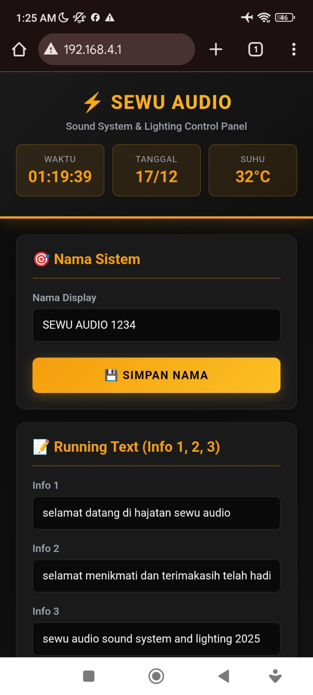
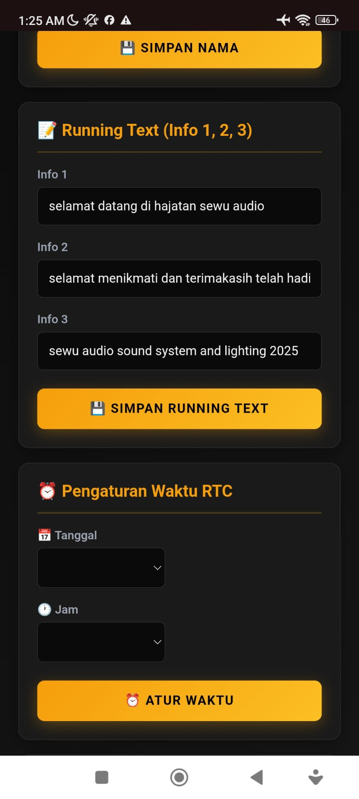
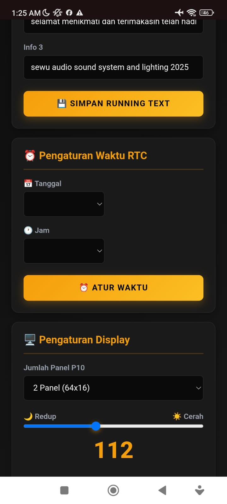
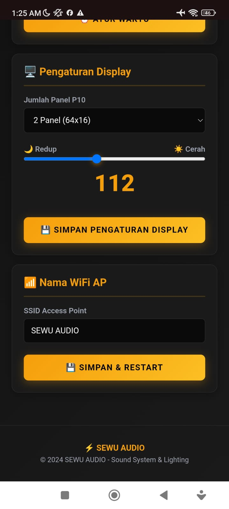

# ⚡ SEWU AUDIO - Running Text Display System

<p align="center">
  
</p>

**SEWU AUDIO** adalah sistem display LED P10 berbasis NodeMCU ESP8266 untuk menampilkan jam, tanggal, suhu, dan informasi running text. Cocok untuk sound system, rental, hajatan, dan keperluan promosi.

---

## 📋 Daftar Isi

- [Fitur](#-fitur)
- [Hardware yang Dibutuhkan](#-hardware-yang-dibutuhkan)
- [Wiring Diagram](#-wiring-diagram)
- [Instalasi](#-instalasi)
- [Penggunaan](#-penggunaan)
- [Screenshot Web Interface](#-screenshot-web-interface)
- [Tampilan LED Display](#-tampilan-led-display)
- [Konfigurasi](#-konfigurasi)
- [Troubleshooting](#-troubleshooting)
- [Lisensi](#-lisensi)

---

## ✨ Fitur

| Fitur | Deskripsi |
|-------|-----------|
| 🕐 **Jam Digital Besar** | Tampilan jam dengan animasi smooth |
| 📅 **Tanggal & Hari** | Format Indonesia (Senin, Selasa, dst.) |
| 🌡️ **Sensor Suhu** | Dari RTC DS3231 built-in |
| 📝 **3 Running Text** | Info 1, Info 2, Info 3 yang bisa dikustomisasi |
| 🖥️ **Multi Panel Support** | 1, 2, 3, atau 4 Panel P10 |
| 🌐 **Web Interface** | Kontrol via WiFi AP dengan UI modern |
| 🔆 **Brightness Control** | Atur kecerahan LED (18-255) |
| 💾 **Auto Save** | Semua pengaturan tersimpan di SPIFFS |

---

## 🛠️ Hardware yang Dibutuhkan

| Komponen | Qty | Keterangan |
|----------|-----|------------|
| NodeMCU ESP8266 | 1 | V2 atau V3 |
| LED Panel P10 (Merah) | 1-4 | Sesuai kebutuhan |
| RTC DS3231 | 1 | Real Time Clock + Sensor Suhu |
| Power Supply 5V | 1 | Minimal 4A per panel |
| Kabel Jumper | - | Secukupnya |

---

## 🔌 Wiring Diagram

### **LED P10 ke NodeMCU**

| Pin P10 | GPIO | NodeMCU |
|---------|------|---------|
| 2 (A) | GPIO16 | D0 |
| 4 (B) | GPIO12 | D6 |
| 8 (CLK) | GPIO14 | D5 |
| 10 (SCK) | GPIO0 | D3 |
| 12 (R) | GPIO13 | D7 |
| 1 (NOE) | GPIO15 | D8 |
| 3 (GND) | GND | GND |

### **RTC DS3231 ke NodeMCU**

| Pin RTC | NodeMCU |
|---------|---------|
| SCL | D1 (GPIO5) |
| SDA | D2 (GPIO4) |
| VCC | 3V |
| GND | GND |

```
                    ┌─────────────────┐
                    │   NodeMCU       │
                    │   ESP8266       │
    ┌───────┐       │                 │       ┌───────────┐
    │ RTC   │──SCL──│ D1          D0 │───A───│           │
    │DS3231 │──SDA──│ D2          D6 │───B───│  LED P10  │
    │       │──VCC──│ 3V          D5 │──CLK──│  PANEL    │
    │       │──GND──│ GND         D3 │──SCK──│           │
    └───────┘       │             D7 │───R───│           │
                    │             D8 │──NOE──│           │
                    │            GND │──GND──│           │
                    └─────────────────┘       └───────────┘
                                                    │
                                              ┌─────┴─────┐
                                              │ PSU 5V 4A │
                                              └───────────┘
```

> ⚠️ **Penting:** LED P10 membutuhkan power supply eksternal 5V terpisah!

---

## 📥 Instalasi

### 1. Install Library Arduino IDE

Buka **Sketch → Include Library → Manage Libraries**, lalu install:

- `ArduinoJson` (v6.x)
- `Rtc by Makuna`

Library tambahan (install manual):
- [HJS589](https://github.com/example/HJS589) - DMD Library untuk ESP8266

### 2. Konfigurasi Arduino IDE

- **Board:** NodeMCU 1.0 (ESP-12E Module)
- **Flash Size:** 4MB (FS:2MB OTA:~1019KB)
- **Upload Speed:** 115200

### 3. Upload Sketch

1. Buka file `jadwaljamsholat1.ino`
2. Pastikan semua file header ada di folder yang sama:
   - `sewuwebpage.h`
3. Upload ke NodeMCU
4. Done! ✅

---

## 🚀 Penggunaan

### Koneksi WiFi

1. Setelah upload, NodeMCU akan membuat **WiFi Access Point**
2. Hubungkan HP/Laptop ke WiFi: **`SEWU AUDIO`**
3. Password: **`sewuaudio123`**
4. Buka browser, akses: **`http://192.168.4.1`**

### Menu Web Interface

| Menu | Fungsi |
|------|--------|
| 🎯 Nama Sistem | Ubah nama display (header running text) |
| 📝 Running Text | Atur 3 teks info yang berputar |
| ⏰ Waktu RTC | Set tanggal dan jam |
| 🖥️ Display | Pilih jumlah panel & brightness |
| 📶 WiFi AP | Ubah nama SSID Access Point |

---

## 📱 Screenshot Web Interface

<p align="center">
  
  
</p>

<p align="center">
  
  
</p>

---

## 📺 Tampilan LED Display

### Urutan Display Cycle

```
┌─────────────┐     ┌─────────────┐     ┌─────────────┐
│  JAM BESAR  │ ──► │   TANGGAL   │ ──► │    SUHU     │
│  (10 detik) │     │  (6 detik)  │     │  (6 detik)  │
└─────────────┘     └─────────────┘     └─────────────┘
       ▲                                       │
       │                                       ▼
┌─────────────┐     ┌─────────────┐     ┌─────────────┐
│   INFO 3    │ ◄── │   INFO 2    │ ◄── │   INFO 1    │
│  (scroll)   │     │  (scroll)   │     │  (scroll)   │
└─────────────┘     └─────────────┘     └─────────────┘
```

### Visual Per Panel

**1 Panel (32x16)**
```
┌────────────────────────────────┐
│  ┌────┐                        │
│  │12  │  :30                   │
│  │    │   45                   │
│  └────┘                        │
└────────────────────────────────┘
```

**2 Panel (64x16)**
```
┌────────────────────────────────────────────────────────────────┐
│           ┌────────┐                                           │
│           │  12    │     :30                                   │
│           │        │      45                                   │
│           └────────┘                                           │
└────────────────────────────────────────────────────────────────┘
```

**4 Panel (128x16)**
```
┌────────────────────────────────────────────────────────────────────────────────────────────────────────────────────────────────┐
│                                                    12:30:45                                                                    │
│  ═══════════════════════════════════════════════════════════════════════════════════════════════════════════════               │
│  ←←←←←←← selamat datang di hajatan sewu audio sound system and lighting professional ←←←←←←←                                  │
└────────────────────────────────────────────────────────────────────────────────────────────────────────────────────────────────┘
```

---

## ⚙️ Konfigurasi

### Default Settings

| Parameter | Default Value |
|-----------|---------------|
| Nama Display | `SEWU AUDIO` |
| Info 1 | `selamat datang di hajatan sewu audio` |
| Info 2 | `selamat menikmati` |
| Info 3 | `sewu audio sound system and lighting` |
| WiFi SSID | `SEWU AUDIO` |
| WiFi Password | `sewuaudio123` |
| Brightness | `100` |
| Panel Count | `2` |

### File Konfigurasi (SPIFFS)

| File | Isi |
|------|-----|
| `/configinfo.json` | nama, info1, info2, info3 |
| `/configdisp.json` | cerah, panelCount |
| `/configwifi.json` | wifissid |

---

## 🔧 Troubleshooting

| Masalah | Solusi |
|---------|--------|
| LED tidak menyala | Cek power supply 5V, pastikan minimal 4A per panel |
| WiFi tidak muncul | Reset NodeMCU, tunggu 10 detik |
| Jam tidak akurat | Set ulang waktu via web interface |
| Web tidak bisa diakses | Pastikan terhubung ke WiFi AP yang benar |
| Display berkedip | Kurangi brightness, cek koneksi kabel |

### Serial Monitor Debug

Buka Serial Monitor (115200 baud) untuk melihat log:

```
SEWU AUDIO - Running Text System
================================
RTC initialized
AP SSID: SEWU AUDIO
AP IP: 192.168.4.1
HTTP server started
```

---

## 📁 Struktur File

```
jadwaljamsholat1/
├── jadwaljamsholat1.ino    # Main sketch
├── sewuwebpage.h           # Web UI HTML/CSS/JS
├── README.md               # Dokumentasi ini
└── images/
    ├── ss1.png             # Screenshot 1
    ├── ss2.png             # Screenshot 2
    ├── ss3.png             # Screenshot 3
    └── ss4.png             # Screenshot 4
```

---

## 📜 Lisensi

```
MIT License

Copyright (c) 2024 SEWU AUDIO

Permission is hereby granted, free of charge, to any person obtaining a copy
of this software and associated documentation files (the "Software"), to deal
in the Software without restriction, including without limitation the rights
to use, copy, modify, merge, publish, distribute, sublicense, and/or sell
copies of the Software...
```

---

## 👨‍💻 Credits

- **SEWU AUDIO** - Sound System & Lighting
- **HJS589 Library** - DMD porting for ESP8266 by dmk007
- **Rtc Library** - by Makuna
- **ArduinoJson** - by Benoît Blanchon

---

<p align="center">
  <b>⚡ SEWU AUDIO - Sound System & Lighting ⚡</b><br>
  <i>Professional Running Text Display System</i>
</p>
